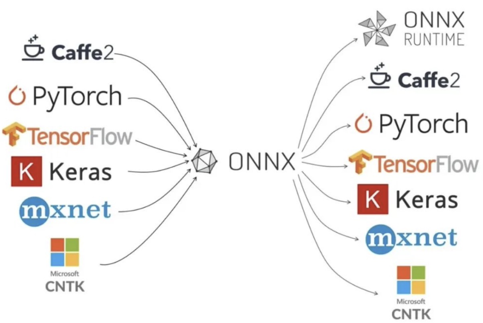
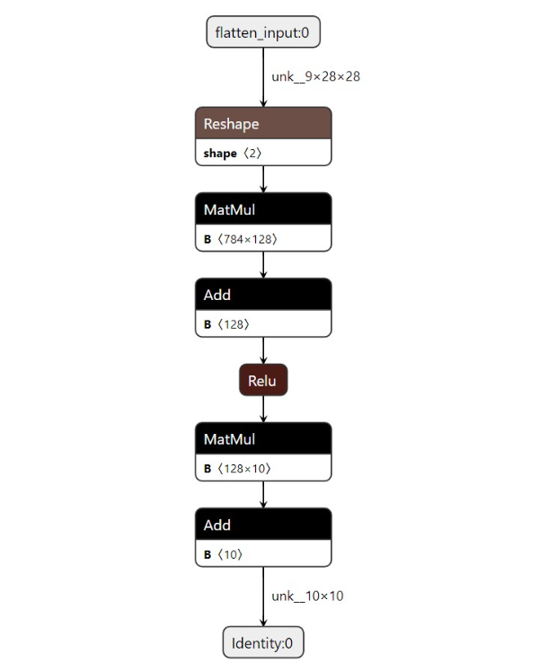

<head>
    <script src="https://cdn.mathjax.org/mathjax/latest/MathJax.js?config=TeX-AMS-MML_HTMLorMML" type="text/javascript"></script>
    <script type="text/x-mathjax-config">
        MathJax.Hub.Config({
            tex2jax: {
            skipTags: ['script', 'noscript', 'style', 'textarea', 'pre'],
            inlineMath: [['$','$']]
            }
        });
    </script>
</head>

## EVO Model


### 1 Model Param

#### 1.1 Complex Analysis

1. 浮点运算次数（*FLOPs, Floating-point Operantion*）：计算量，衡量算法/模型时间复杂度。
2. 每秒执行浮点运算次数（*FLOPS, Floating-ponit Operations Per Second*）：计算速度，衡量硬件性能/速度的指标，即芯片算力。
3. 乘加操作次数（*MACCs, Multiply-accumulate Operations*）：MACCs大约是FLOPs的一半，将$w_0 * x_0$视为一次运算。
4. 模型参数（*Params*）：模型含有多少参数，直接决定模型大小和推理时内存占用（单位：MB），通常参数用float32表示，所以模型大小（单位：Byte）约为参数数量的4倍。
5. 内存访问代价（*MAC, Memory Access Cost*）：输入单个样本，模型/卷积完成一次前向传播发生的内存交换总量，即模型的空间复杂度（单位：Byte）。
6. 内存带宽：决定了数据从内存（vRAM）移动到计算核心的速度，是比计算速度更具代表性的指标。内存带宽值取决于内存和计算核心之间的数据传输速度，以及这两个部分之间总线中单独并行链路数量。

#### 1.2 Demo for Complex

用标准卷积层（*std conv*）贡献计算量：

- Params: $k_h * k_w * c_{in} * c_{out}$
- FLOPs: $k_h * k_w * c_{in} * c_{out} * H * W$


#### 1.2 Hardware Params

1. GPU：显存（vRAM）大小、显存带宽、计算核心数、计算速度（FLOPS）。
2. CPU：内存大小、内存带宽、计算核心数、计算速度（FLOPS）。

---

### 2 Model Format

#### 2.1 ProtoBuffer & FlatBuffer

|       | ProtoBuffer | FlatBuffer |
|:-----:|:-----------:|:----------:|
| Lang  | C/C++, C#, Go, Java, Python, Ruby, Objective-C, Dart | C/C++, C#, Java, Lua, Python, Rust ... |
| Version | 2.x / 3.x |  1.x  |
| File  | `.proto` | `.fbs` |
| Type  |  More  | Base |
| Model |  `.onnx`  | `.tflite` |
| Load  |   Normal  |   Fast    |
| Size  |   Normal  |   Small   |

---

#### 2.2 ONNX

- ONNX(*Open Neural Network Exchange*): 使用 `ProtoBuf` 进行序列化的二进制模型文件格式，十分通用，主流框架（如：Pytorch, TensorFlow）对该格式导出都有相关支持：




- 模型可视化，通过`netron`插件可以可视化模型文件，从而观察算子和张量形状：




---

#### 2.3 tflite

- tflite 是 TensorFlow Lite 的模型文件格式，使用 `FlatBuffer` 进行序列化，较为轻量级，适用于移动端设备.


---

### 3 EVO Tiny Model

`.etm`是 EVO 小型模型的格式


- 使用如下 unix 命令会将`.etm`模型转换为 C 源文件（`unsigned char`类型）：

```shell
xxd -i model.etm > model_data.c
```

- 使用如下 unix 命令会将`.c`源文件转换为`.etm`模型文件：

```shell
grep -E "(0x[0-9a-f]{2}(,|)){1,16}" model_data.c | xxd -r -p > model.etm
```