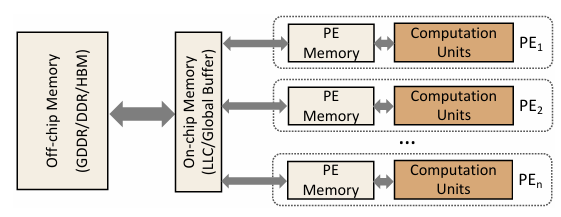

## EVO Profiler


### 1 延时预测模型 Latency prediction model

To accurately predict the cost on both data movement and computation, Three-level structure:
1) Off-chip memory
2) On-chip global memory 
3) Memory in PE




#### 1.1 Latency data

frequency: Hz
mem_bandwidth: B/s


### 2 前向梯度 Grad-CAM

要计算基于前向梯度的 Grad-CAM，通常需要以下步骤：

#### 2.1 前向传播
首先，将输入数据通过神经网络进行前向传播，直到获得网络的输出（通常是分类器的输出）。

#### 2.2 提取最后一层卷积层的特征图
在前向传播过程中，保存网络中最后一层卷积层的激活特征图。假设这个特征图为 $A^k$，其中 $k$ 表示特征图的通道索引。

#### 2.3 计算与类别相关的前向梯度
接着，计算网络输出中目标类别的分数对每个特征图通道的梯度。这一步与传统 Grad-CAM 的反向传播不同，这里使用的是前向传播的梯度计算，公式如下：

$$
\alpha_k = \frac{\partial y_c}{\partial A^k}
$$

其中，$y_c$ 是目标类别的得分，$\alpha_k$ 是每个通道 $k$ 的权重，表示这个通道在决策过程中的重要性。

#### 2.4 计算加权特征图
使用上一步计算的权重 $\alpha_k$ 对对应的特征图 $A^k$ 进行加权求和，生成类激活图：

$$
L_{\text{Grad-CAM}} = \text{ReLU}\left(\sum_k \alpha_k A^k\right)
$$

这里使用 ReLU 函数是为了只保留对目标类别有正贡献的区域。

#### 2.5 上采样至输入图像大小
将生成的类激活图上采样到与输入图像相同的尺寸，以便生成对应的热力图。

#### 2.6 归一化并叠加在原图上
将类激活图进行归一化处理（例如通过 min-max 归一化），然后将其叠加在原始输入图像上，形成最终的 Grad-CAM 热力图。

#### 2.7 代码实现（伪代码）
以下是一个基于 PyTorch 的简单伪代码实现：

```python
import torch
import torch.nn.functional as F

def grad_cam_forward(model, input, target_class):
    # Step 1: Forward pass through the model
    features = model.features(input)
    output = model.classifier(features)
    
    # Step 2: Extract the feature map and target class score
    feature_map = features[-1]  # Assuming this is the last conv layer output
    score = output[0, target_class]
    
    # Step 3: Compute the gradients with respect to the target class score
    model.zero_grad()
    score.backward(retain_graph=True)
    
    # Step 4: Obtain the gradients and weights
    gradients = features.grad
    weights = torch.mean(gradients, dim=(2, 3), keepdim=True)
    
    # Step 5: Compute the Grad-CAM map
    grad_cam_map = F.relu(torch.sum(weights * feature_map, dim=1, keepdim=True))
    
    # Step 6: Upsample to input image size
    grad_cam_map = F.interpolate(grad_cam_map, size=input.size()[2:], mode='bilinear', align_corners=False)
    
    # Step 7: Normalize the heatmap
    grad_cam_map = (grad_cam_map - grad_cam_map.min()) / (grad_cam_map.max() - grad_cam_map.min())
    
    return grad_cam_map

# Example usage:
model = MyModel()
input_image = torch.randn(1, 3, 224, 224)
target_class = 0  # Target class index
heatmap = grad_cam_forward(model, input_image, target_class)
```

#### 2.8 注意事项
- 这种方法比传统的 Grad-CAM 快一些，因为它仅依赖前向传播计算梯度。
- 适用于网络中激活函数对特征的正贡献区域非常重要的情况。
- 在图像分类任务中，如果最后一层卷积输出的特征图已经是 1×1000×1×1 的形状，这意味着特征图已经被压缩到非常小的空间尺度。这种情况下，传统的 Grad-CAM 方法可能无法生成有用的热力图，因为 Grad-CAM 依赖于在较大空间尺度上的特征图来识别重要的空间位置。

> 处理方法：
> 
> 1. 使用更早的卷积层特征图:
> 在 Grad-CAM 中，可以选择较早的卷积层，这些层的特征图在空间上仍然保留一定的分辨率。这样可以生成具有空间信息的热力图。
> 通过修改网络的前向传播逻辑，在计算 Grad-CAM 时提取适合的卷积层输出。例如，选择倒数第二个卷积层或其他更早的卷积层来生成热力图。
> 
> 2. 结合全局平均池化 (GAP):
> 如果您的网络使用了全局平均池化（GAP）层来生成最终的分类特征向量，那么在计算 Grad-CAM 时可以考虑使用 GAP 之前的卷积特征图。

#### 2.9 应用场景
基于前向梯度的 Grad-CAM 在一些实时推理的应用中非常有用，比如视频流的目标检测等场景，因为它减少了对反向传播计算的依赖。


### Refence

- [nn-meter](https://air.tsinghua.edu.cn/pdf/nn-Meter-Towards-Accurate-Latency-Prediction-of-Deep-Learning-Model-Inference-on-Diverse-Edge-Devices.pdf)
- [Latency-aware Spatial-wise Dynamic Networks](https://proceedings.neurips.cc/paper_files/paper/2022/file/ef472869c217bf693f2d9bbde66a6b07-Paper-Conference.pdf)