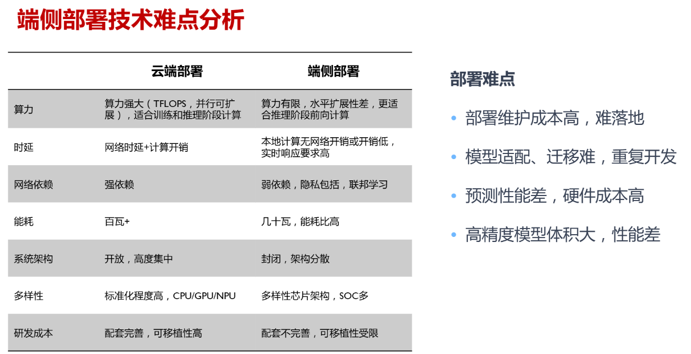

## EVO Reference

- Here are some items related to TinyML OpenSource FrameWork:

|  Item  |  Type  | Lang |  Company  | Platform |  Targets  |  Main Func  |  Main Opt  |
|:------:|:------:|:----:|:---------:|:----:|:---------:|:-----------:|:----------:|
| [TinyMaix](https://github.com/sipeed/TinyMaix) | Infer | C | Sipeed | **MCU** | SSE NEON CSKYV2 RV32P |  | Inline Asm, |
| [ORT](https://github.com/microsoft/onnxruntime.git) | Infer | C++ | Microsoft | **PC, Server** | SSE AVX NEON CUDA |  | Inline Asm, |
| [microTVM](https://xinetzone.github.io/tvm/docs/arch/microtvm_design.html) | Infer | C++ | Apache | **Paper** |
| [TFLM](https://github.com/tensorflow/tflite-micro) | Infer | C++ | Google | **MCU** Arm(Cortex-M), Hexagon, RISC-V, Xtensa | ??? | ??? | ??? |
| [NCNN](https://github.com/Tencent/ncnn) | Infer | C/C++ | Tencent | **Phone** | 
| [CoreML](https://github.com/apple/coremltools) | Train & Infer | Swift | Apple | **IPhone** Arm(Cortex-M) | Metal | ??? | ??? |
| [MNN](https://github.com/alibaba/MNN) | Train & Infer | C++ | Alibaba | **Phone** Arm(Cortex-M/A) | SSE AVX NEON Metal HIAI OpenCL Vulkan CUDA Metal | Convert, Compress, Express, Train, CV | Inline Asm, Winograd Conv, FP16 | 
| [MindSpore](https://github.com/mindspore-ai/mindspore) | Train & Infer | C++/Python | HuaWei? | **All?** |

性能：

### 1 主流引擎架构

大模型全栈架构图：

推理引擎架构：

端侧部署：

