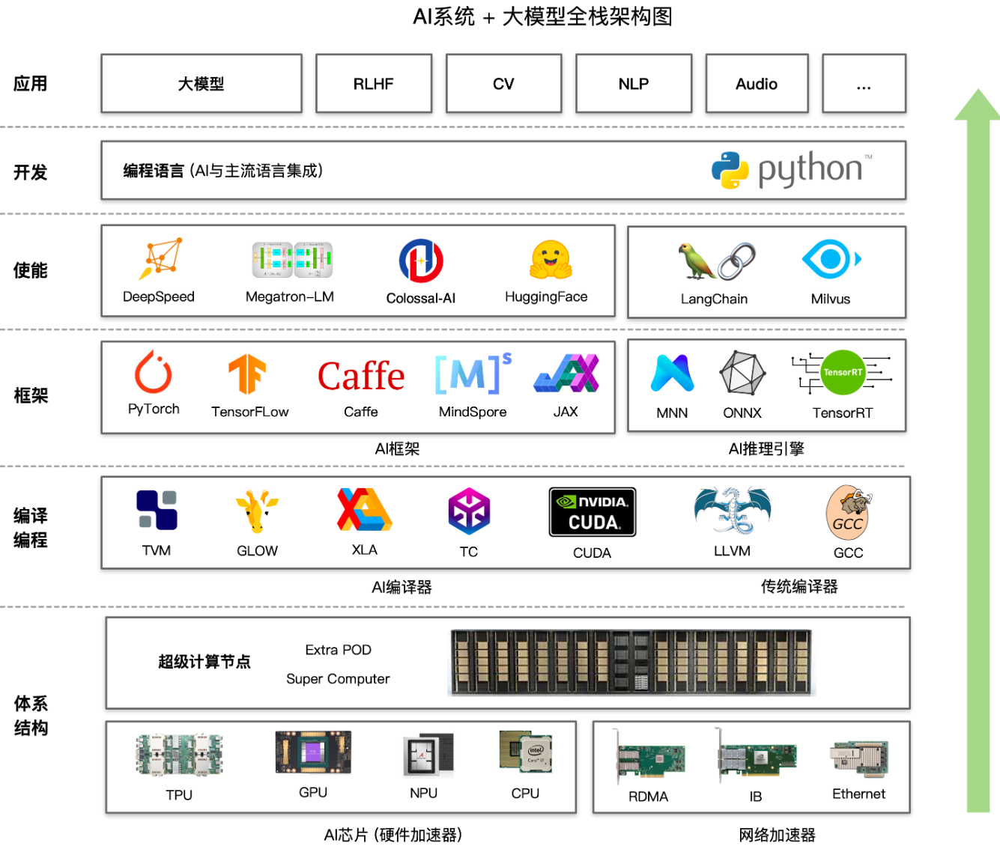

## EVO Reference

- Here are some items related to TinyML OpenSource FrameWork:

|  Item  |  Type  | Lang |  Company  | Platform |  Targets  |  Main Func  |  Main Opt  |
|:------:|:------:|:----:|:---------:|:----:|:---------:|:-----------:|:----------:|
| [TinyMaix](https://github.com/sipeed/TinyMaix) | Infer | C | Sipeed | **MCU** | SSE NEON CSKYV2 RV32P |  | Inline Asm, |
| [ORT](https://github.com/microsoft/onnxruntime.git) | Infer | C++ | Microsoft | **PC, Server** | SSE AVX NEON CUDA |  | Inline Asm, |
| [microTVM](https://xinetzone.github.io/tvm/docs/arch/microtvm_design.html) | Infer | C++ | Apache | **Paper** |
| [TFLM](https://github.com/tensorflow/tflite-micro) | Infer | C++ | Google | **MCU** Arm(Cortex-M), Hexagon, RISC-V, Xtensa | ??? | ??? | ??? |
| [NCNN](https://github.com/Tencent/ncnn) | Infer | C/C++ | Tencent | **Phone** | 
| [CoreML](https://github.com/apple/coremltools) | Train & Infer | Swift | Apple | **IPhone** Arm(Cortex-M) | Metal | ??? | ??? |
| [MNN](https://github.com/alibaba/MNN) | Train & Infer | C++ | Alibaba | **Phone** Arm(Cortex-M/A) | SSE AVX NEON Metal HIAI OpenCL Vulkan CUDA Metal | Convert, Compress, Express, Train, CV | Inline Asm, Winograd Conv, FP16 | 
| [MindSpore](https://github.com/mindspore-ai/mindspore) | Train & Infer | C++/Python | HuaWei? | **All?** |

性能：

### 1 主流引擎架构

大模型全栈架构图：

推理引擎架构：

### 2 TinyML的推理引擎

端侧部署：

AI部署平台细分：

|PlatformLevel|AI-Box  |AI-Camera    |AIoT         |TinyML       |
|---          |---     |---          |---          |---          |
|Storage Media|eMMC/SSD|eMMC/Nand/Nor|Nor/SIP Flash|Nor/SIP Flash|
|Storage Size |>=8GB   |16MB~8GB     |1~16MB       |16KB~16MB    |
|Memory Media |DDR4    |mostly DDR3  |SRAM/PSRAM   |SRAM/PSRAM   |
|Memory Size  |>=2GB   |64MB~2GB     |0.5~64MB     |2KB~8MB      |
|CPU Freq     |>=1.5G  |0.5~1.5G     |100~500M     |16~500M      |
|Computing Power|>=2TOPS|0.2~1TOPS   |50~200GOPS   |<1GOPS       |
|Deploy Language|python/c++|python/c++|mpy/C       |mostly C     |
|Typical Device|JetsonNano|RV1109 IPC|BL808/K210   |ESP32/BL618  |
|Typical Board Price|>$100|$20~$100  |$5~$20       |<$5          |
|Typical Chip Price|>$10|$4~$10      |$2~$5        |$1~$3        |

兼容性与性能之间平衡：
1. 读入模型支持`.onnx`来提升框架兼容性，将读入后的模型压缩为自定义的运行时模型，降低运行时内存开销（使用`flatbuffer`）；
2. 动态静态图优化：主要性能瓶颈在于运行时内存与数据IO，对于TinyML的场景需要做专项的量化、调度方案；
3. 异构执行与内联汇编：选取热点算子进行内联汇编优化，支持硬件汇编指令，提升推理速度；
4. 计算加载与卸载：需要搭建模型数据库，针对模型选取推理网络类型（边缘独立推理、边缘集群推理、云边协同推理），在指定网络下，尽量降低推理时延和内存占用；