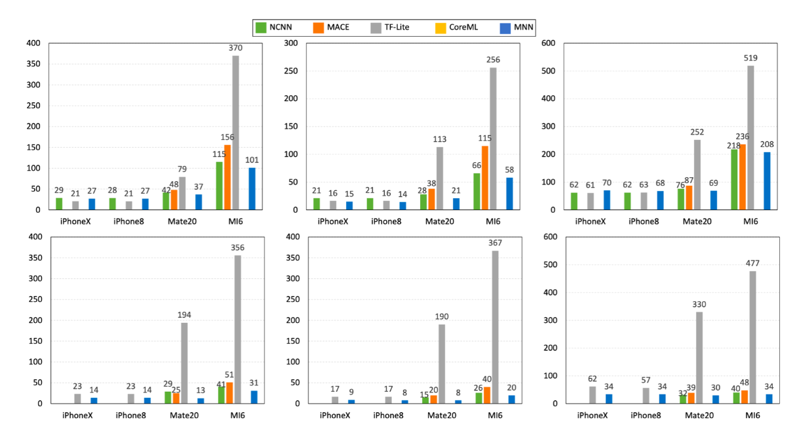

## EVO Reference

- Here are some items related to TinyML OpenSource FrameWork:

|  Item  |  Type  | Lang |  Company  | Platform |  Targets  |  Main Func  |  Main Opt  |
|:------:|:------:|:----:|:---------:|:----:|:---------:|:-----------:|:----------:|
| [TinyMaix](https://github.com/sipeed/TinyMaix) | Infer | C | Sipeed | **MCU** | SSE NEON CSKYV2 RV32P |  | Inline Asm, |
| [ORT](https://github.com/microsoft/onnxruntime.git) | Infer | C++ | Microsoft | **PC, Server** | SSE AVX NEON CUDA |  | Inline Asm, |
| [microTVM](https://xinetzone.github.io/tvm/docs/arch/microtvm_design.html) | Infer | C++ | Apache | **Paper** |
| [TFLM](https://github.com/tensorflow/tflite-micro) | Infer | C++ | Google | **MCU** Arm(Cortex-M), Hexagon, RISC-V, Xtensa | ??? | ??? | ??? |
| [NCNN](https://github.com/Tencent/ncnn) | Infer | C/C++ | Tencent | **Phone** | 
| [CoreML](https://github.com/apple/coremltools) | Train & Infer | Swift | Apple | **IPhone** Arm(Cortex-M) | Metal | ??? | ??? |
| [MNN](https://github.com/alibaba/MNN) | Train & Infer | C++ | Alibaba | **Phone** Arm(Cortex-M/A) | SSE AVX NEON Metal HIAI OpenCL Vulkan CUDA Metal | Convert, Compress, Express, Train, CV | Inline Asm, Winograd Conv, FP16 | 
| [MindSpore](https://github.com/mindspore-ai/mindspore) | Train & Infer | C++/Python | HuaWei? | **All?** |

性能：




### 1 主流引擎架构


大模型全栈架构图：


推理引擎架构：


### 2 TinyML的推理引擎

端侧部署：


AI部署平台细分：

|PlatformLevel|AI-Box  |AI-Camera    |AIoT         |TinyML       |
|---          |---     |---          |---          |---          |
|Storage Media|eMMC/SSD|eMMC/Nand/Nor|Nor/SIP Flash|Nor/SIP Flash|
|Storage Size |>=8GB   |16MB~8GB     |1~16MB       |16KB~16MB    |
|Memory Media |DDR4    |mostly DDR3  |SRAM/PSRAM   |SRAM/PSRAM   |
|Memory Size  |>=2GB   |64MB~2GB     |0.5~64MB     |2KB~8MB      |
|CPU Freq     |>=1.5G  |0.5~1.5G     |100~500M     |16~500M      |
|Computing Power|>=2TOPS|0.2~1TOPS   |50~200GOPS   |<1GOPS       |
|Deploy Language|python/c++|python/c++|mpy/C       |mostly C     |
|Typical Device|JetsonNano|RV1109 IPC|BL808/K210   |ESP32/BL618  |
|Typical Board Price|>$100|$20~$100  |$5~$20       |<$5          |
|Typical Chip Price|>$10|$4~$10      |$2~$5        |$1~$3        |


兼容性与性能之间平衡：
1. 读入模型支持`.onnx`来提升框架兼容性，将读入后的模型压缩为自定义的运行时模型，降低运行时内存开销（使用`flatbuffer`）；
2. 动态静态图优化：主要性能瓶颈在于运行时内存与数据IO，对于TinyML的场景需要做专项的量化、调度方案；
3. 异构执行与内联汇编：选取热点算子进行内联汇编优化，支持硬件汇编指令，提升推理速度；
4. 计算加载与卸载：需要搭建模型数据库，针对模型选取推理网络类型（边缘独立推理、边缘集群推理、云边协同推理），在指定网络下，尽量降低推理时延和内存占用；


### 3 部署实验

#### 3.1 实验环境

- 实验环境：PC端（Linux + x86_64）、MCU端（PynqZ2 + Arm）
- 实验目标：测试各个推理引擎（主要：`TinyMaix`, `TFLM`, `ORT`, `microTVM`）在边缘侧推理的指标
- 实验指标：性能（内存占用，推理时间）、易用性（评估部署时间）、兼容性（多平台部署）
- 实验数据：收集常用DL模型（格式：`.onnx`, `.tflite`）、MLPerf测试


#### 3.2 TFLM

TFLM(*TensorFlow Lite for Microcontrollers*)自称其运行时（runtime）在 Cortex M3 上仅需 16KB，可以直接在“裸机”上运行，不需要操作系统支持。

> 参考：
>
> - [TernsorFlow 官方教程]([ps://ten](https://tensorflow.google.cn/lite/microcontrollers/get_started?hl=zh-cn))
> - [使用TensorFlow Lite Micro流程记录](https://blog.csdn.net/ZhaoDongyu_AK47/article/details/139148425)


##### 3.2.1 构建

TFLM 使用 Bazel 构筑工具（Google很喜欢这玩意，基于JRM的，有些难用）

1. 在[Bazel仓库](https://github.com/bazelbuild/bazel/releases)去选择适合版本下载，这里是x86_64：
```shell
# 下载可执行文件
wget https://github.com/bazelbuild/bazel/releases/download/7.2.1/bazel-7.2.1-linux-x86_64
# 移动到/usr/local/bin
sudo cp ./bazel-7.2.1-linux-x86_64 /usr/local/bin/bazel
# 更新环境变量
source ~/.bashrc
# 检查版本
bazel --version
```

> Bazel 中的配置文件：
>
> 1. `WORKSPACE`：含有该文件的目录将会被视为根目录
> 2. `BUILD`：含有该构建规则文件的目录被视为项目的一个模块


2. 构筑 TFLM

```shell
git clone https://github.com/tensorflow/tflite-micro.git
cd tflite-micro
# 查看构建规则，笑死看不懂
cat BUILD
# 构筑 micro 工具链 ???
bazel build
# 这个管用
make -f tensorflow/lite/micro/tools/make/Makefile TARGET=linux TARGET_ARCH=x86_64 microlite
```


##### 3.2.x 综合评估
