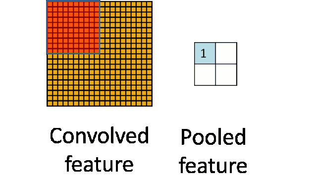

## Pooling: 池化层

### 1 功能
池化操作是特征图矩阵与固定窗口（核）进行计算，并输出新特征图。池化与卷积类似，但无权重，常用的有：
- 最大池化（Max Pooling）
- 平均池化（Average Pooling）

### 2 作用
- 平移（translation）不变性、旋转（rotation）不变性、尺寸（scale）不变性
- 减少参数量，降低计算复杂度
- 保持特征图大小不变，降低特征图分辨率，提取特征图中的关键信息
- 增加特征图的鲁棒性，防止过拟合

### 3 实现
- 输出特征图大小计算公式：$ \left\lfloor \frac{W - K}{S} + 1 \right\rfloor $，其中 $ W $ 为输入特征图大小，$ K $ 为核大小，$ S $ 为步长。
- 参数：
  - `kernel_size`: 池化层窗口（核）大小
  - `stride`: 步长，每次移动像素数
  - `padding`: 数据中添加额外数据（补充0），满足格式或长度
  - `ceil_mode`: 如果设定为`True`，则向上取整。
- 例子：输入`[3,201,250]`，设定`kernel_size=6, stride=2`，输出`[3,98,123]`

