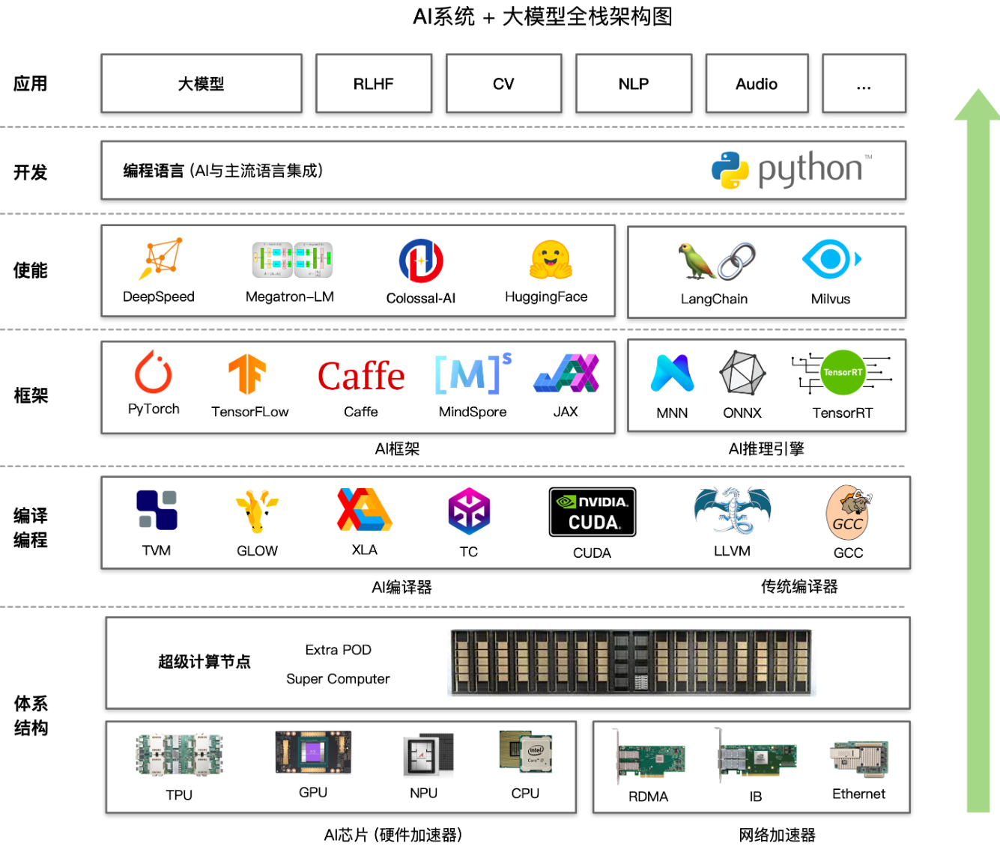
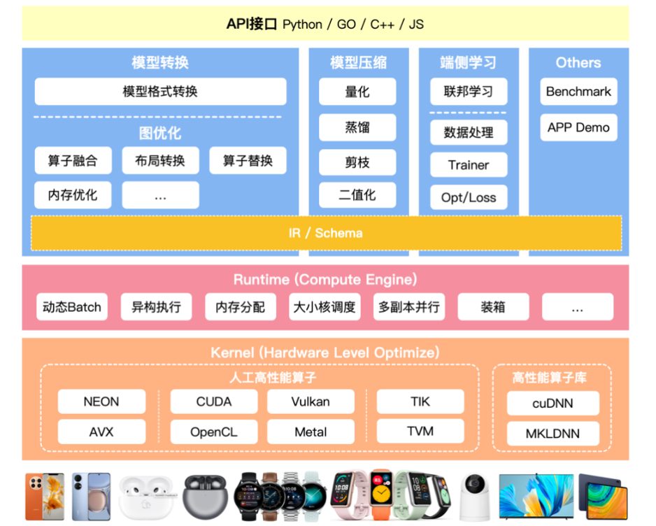
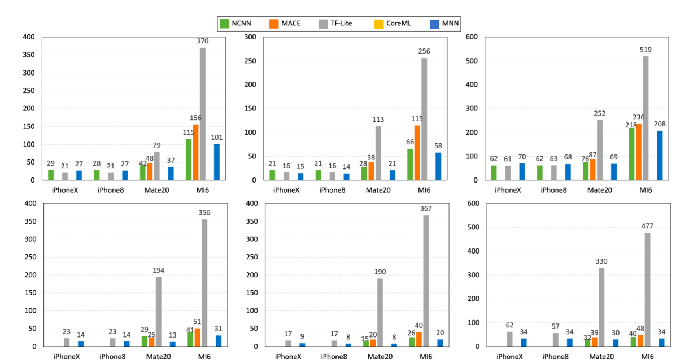

<!-- _header: 'Compute InkJet Lab' -->
<!-- _footer: evo | [Github](https://github.com/lancerstadium/evo/tree/ml) | [Docs](https://lancerstadium.github.io/evo/docs) -->

# 01 TinyML 推理引擎概述

###### 作者：鲁天硕
###### 时间：2024/7/15

---

---
### 1.1 推理引擎架构

当前主流推理引擎框架都采用分层式设计，主要包含静态侧和动态侧两部分功能：
1. 静态侧：模型转换、静态模型压缩、静态图优化 ...
2. 动态侧：模型加载、运行时量化、异构执行 ...

---
### 1.2 主流推理引擎

|  Item  |  Type  | Lang |  Company  | Platform |
|:------:|:------:|:----:|:---------:|:----:|
| [TinyMaix](https://github.com/sipeed/TinyMaix) | Infer | C | Sipeed | **MCU** |
| [ORT](https://github.com/microsoft/onnxruntime.git) | Infer | C++ | Microsoft | **PC, Server** |
| [microTVM](https://xinetzone.github.io/tvm/docs/arch/microtvm_design.html) | Infer | C++ | Apache | **Paper** |
| [TFLM](https://github.com/tensorflow/tflite-micro) | Infer | C++ | Google | **MCU** |
| [NCNN](https://github.com/Tencent/ncnn) | Infer | C/C++ | Tencent | **Phone** | 
| [CoreML](https://github.com/apple/coremltools) | Train & Infer | Swift | Apple | **IPhone** |
| [MNN](https://github.com/alibaba/MNN) | Train & Infer | C++ | Alibaba | **Phone** |
| [MindSpore](https://github.com/mindspore-ai/mindspore) | Train & Infer | C++/Python | HuaWei? | **All?** |

---
### 1.2 主流推理引擎

---

### 2.1 端侧部署难点

**指标**：性能、易用、兼容、轻量
**难点**：
1. 模型兼容性与内存占用：读入模型支持`.onnx`来提升框架兼容性，将读入后的模型压缩为自定义的运行时模型，降低运行时内存开销（使用`flatbuffer`）；
2. 动态静态图优化：主要性能瓶颈在于运行时内存与数据IO，对于TinyML的场景需要做专项的量化、调度方案；
3. 异构执行与内联汇编：选取热点算子进行内联汇编优化，支持硬件汇编指令，提升推理速度；
4. 计算加载与卸载：需要搭建模型数据库，针对模型选取推理网络类型（边缘独立推理、边缘集群推理、云边协同推理），在指定网络下，尽量降低推理时延和内存占用；

---

### 2.2 常用模型格式

- ONNX(*Open Neural Network Exchange*): 使用 `ProtoBuf` 进行序列化的二进制模型文件格式，十分通用，主流框架（如：Pytorch, TensorFlow）对该格式导出都有相关支持。
- tflite 是 TensorFlow Lite 的模型文件格式，使用 `FlatBuffer` 进行序列化，较为轻量级，适用于移动端设备。

---

### 2.3 模型序列化

|       | ProtoBuffer | FlatBuffer |
|:-----:|:-----------:|:----------:|
| Lang  | C/C++, C#, Go, Java, Python, Ruby, Objective-C, Dart | C/C++, C#, Java, Lua, Python, Rust ... |
| Version | 2.x / 3.x |  1.x  |
| File  | `.proto` | `.fbs` |
| Type  |  More  | Base |
| Model |  `.onnx`  | `.tflite` |
| Load  |   Normal  |   Fast    |
| Size  |   Normal  |   Small   |

---

### 2.4 模型可视化

- 模型可视化，通过`netron`插件可以可视化模型文件，从而观察算子和张量形状：

---

### 3.1 框架初探

- 采用分层式模块架构：
  - 上层提供多种编程语言的开发模块
  - 核心提供模型的转换、压缩以及运行时
  - 下层对Host端设备进行算子调度
- **关键词**: Lite > High Performance > Easy to Use > Compatibility

---

### 3.2 软硬件协同设计

使用`DiffTest`进行交叉验证与性能测试:
1. Server: Trace operators' runtime. Send/receive result tensor_data/operator_asm/perfermance_data
2. Client: Difftest and cross-valid run result

---

### 3.3 后续实验

- 实验环境：PC端（Linux + x86_64）、MCU端（PynqZ2 + Arm）
- 实验目标：测试各个推理引擎（主要：`TinyMaix`, `TFLM`, `ORT`, `microTVM`）在边缘侧推理的指标
- 实验指标：性能（内存占用，推理时间）、易用性（评估部署时间）、兼容性（多平台部署）
- 实验数据：收集常用边缘侧DL模型（格式：`.onnx`, `.tflite`）、MLPerf测试
- 后续分析：提取热点算子进行软件侧实现