<!-- _header: 'Compute InkJet Lab' -->
<!-- _footer: evo | [Github](https://github.com/lancerstadium/evo/tree/ml) | [Docs](https://lancerstadium.github.io/evo/docs) -->

# 02 领域专用的 TinyML 推理引擎

###### 作者：鲁天硕
###### 时间：2024/7/22

---

### 1.1 推理引擎分类

1. 通用场景：`TensorRT`, `OpenVINO`, `Triton`, `OnnxRunTime`
2. 任务级专用：适用于一类任务的推理引擎
   1. 自然语言任务`NLP`：大语言`vLLM`, `llama.c` ...
   2. 图像处理任务`CV`：图像检测，图像识别 ...
3. 平台级专用：适用于一类平台的推理引擎
   1. 云端：（高性能）服务器，PC
   2. 边缘端：（低功耗）手机，MCU
4. 模型级专用：适用于一组模型的推理引擎
   1. 指定结构设计的模型：`CNN`, `RNN`, `Transformer`
   2. 资源消耗较低的模型：`ResNet`, `MobileNet`, `ShuffleNet`

---

### 1.2 推理专用化

**案例**：`lut3d_96.onnx`模型进行边缘侧推理，有如下影响因素：
1. 数据级优化：提高读写`.jpg`, `.tiff`图片格式速度（输入压缩、稀疏化） --> 【吞吐量】
2. 模型级优化：高效模型结构（模型压缩、专用格式） --> 【计算量 | 内存占用】
3. 图级优化：高效运行时（图拆分、跨核并行、算子融合、批处理） --> 【内存占用】
4. 算子级优化：高效算子（硬件加速） --> 【计算速度】
5. 系统级优化：高效系统交互（PCIe流量控制，加速器通信）--> 【吞吐量】

> 注意：在所有优化级别中，`Profiler`都与框架交互收集信息，辅助优化策略。
---

### 2 PAME: Intro
**精确感知的多出口 DNN 服务用于减少批量推理的延迟**
*ICS ’22, June 28–30, 2022, Virtual Event, USA*

**动机**：对于ResNet或Bert这类主干网络（BackBone），可以添加多出口来提前退出，在**大批量查询**的场景下有优势。
（右上：重复28层已经可以达到不错的效果。右下：添加出口的MACs计算开销）

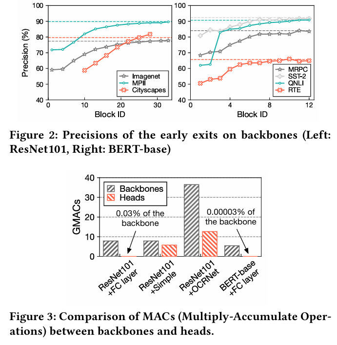

---

### 2 PAME: Model

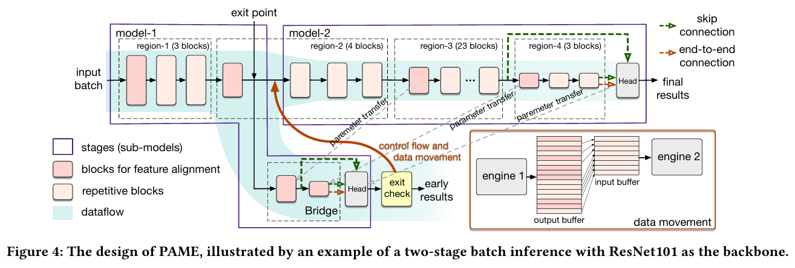

多出口模型构建：
1. 基于现有模型静态插入：主干（BackBone）、桥（连接向量）、头部（出口）
2. 每一步 PAME 都会根据当前输入数据和时延信息来寻找出口。找到的出口将DNN模型分成两部分，递归执行。

---

### 2 PAME: Latency-Aware

PAME 通过收集延迟（*latency*）信息来决定是否退出：
1. 设置退出阈值：根据每个出口的总体精度与继续比率设计退出阈值

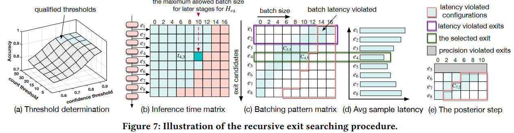

1. 推理时间矩阵&批处理模式矩阵：记录时延信息
2. 时延感知退出：选择平均查询时间最短的第一个出口

---

### 2 PAME: Result

结论：
1. 查询时延：与单出口推理相比，图像分类任务平均查询延迟降低41%，姿态估计任务降低24%，NLP任务平均降低44.8%。 
2. 精度：大部分测试里首次退出精度比Baseline高，总体精度平均为原模型的99.68%。

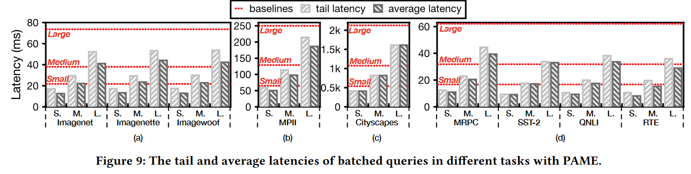

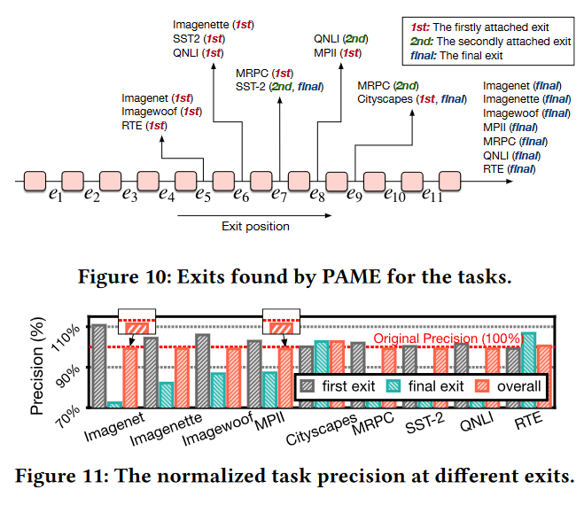

---

### 3 Workflow

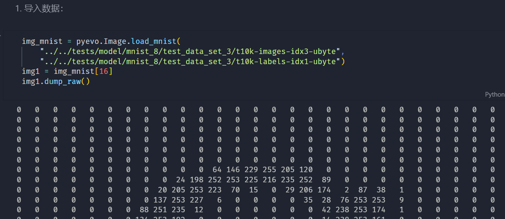

---

### 3 Workflow

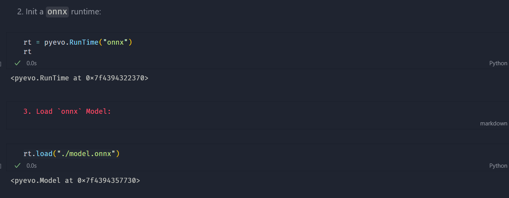

---

### 3 Workflow
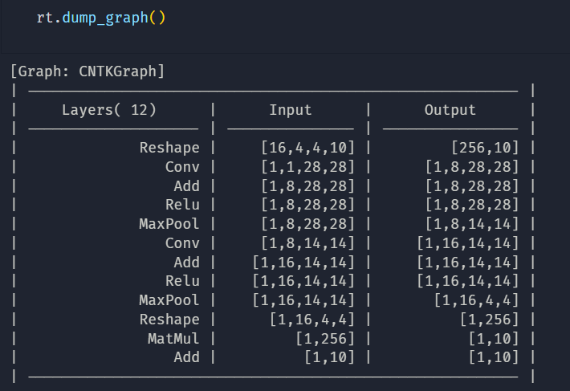

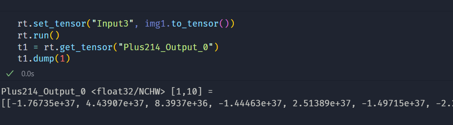

---

### 4 Profiler

1. **数据感知**：输入张量信息(KVCache) ...
2. **运行时信息**：算子时延占比（加速）, 算子调用（融合）...
3. **硬件感知**：伪时延预测，硬件时延，GFLOPS ...

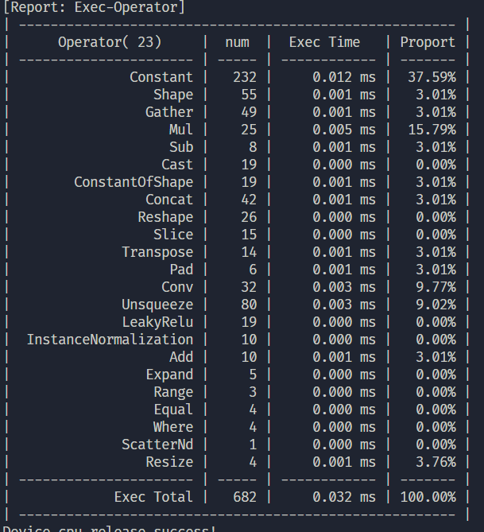

---

### 5 Latency-aware Spatial-wise Dynamic Networks

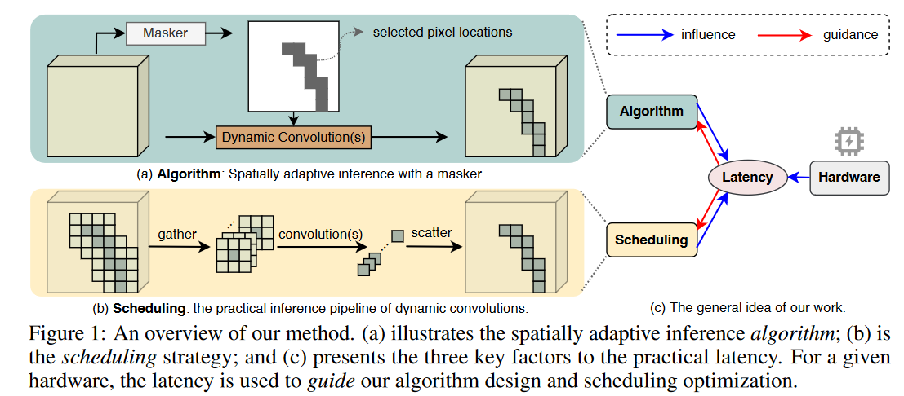

- 算法层：动态卷积
- 引擎层：调度优化