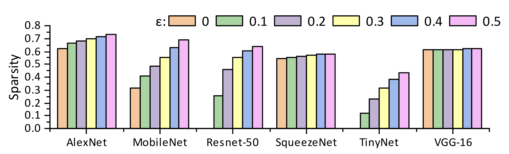
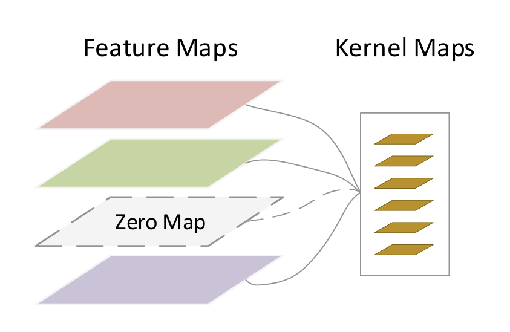
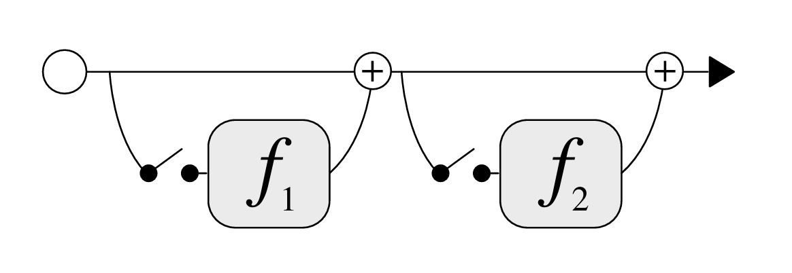

<!-- _header: 'Compute InkJet Lab' -->
<!-- _footer: evo | [Github](https://github.com/lancerstadium/evo/tree/ml) | [Docs](https://lancerstadium.github.io/evo/docs) -->

# 04 动态感知推理引擎

###### 作者：鲁天硕
###### 时间：2024/9/05

---

### 挑战与机遇

目前，资源受限设备的推理部署存在一些挑战[1]：
1. 现有的大部分 DNN 研究集中关注**准确率**（*Accuracy*），在实际部署中常常需要权衡其他指标：每秒处理帧数、数据吞吐量、内存占用等等，如何在精度可接受的范围内提高其他指标是端侧部署主要目标；
2. 主流的静态模型压缩技术（量化、剪枝等）和 网络结构搜索技术（NAS），可以减少一定推理负载，但有**永久损害网络**预测能力的风险，它们消耗大量资源，且对于 MobileNet, SqueezeNet, ShuffleNet 这类参数冗余度小的网络的效果甚微；
3. 大部分推理数据常常存在**局部性与稀疏性**，现有的引擎框架无法针对不同的输入数据选择不同的处理方式，进一步收集**运行时信息**和**硬件信息**进行软硬件协同，通过**动态决策**改善推理性能。

---

### 数据稀疏性

主流网络的中间层特征图[2]的稀疏性：

---

### 相关工作

按照决策级别可以分为如下四类（非纯推理）：
1. Model-wise：...
2. Layer-wise：sact, SkipNet, ConvNet-AIG ...
3. Channel-wise：FalCon ...
4. Point-wise：...

---

### 

---

### 参考文献

[1] Adapting Neural Networks at Runtime: Current Trends in At-Runtime Optimizations for Deep Learning
[2] [Dynamic runtime feature map pruning](https://arxiv.org/pdf/1812.09922)
