<!-- _header: 'Compute InkJet Lab' -->
<!-- _footer: evo | [Github](https://github.com/lancerstadium/evo/tree/ml) | [Docs](https://lancerstadium.github.io/evo/docs) -->

# 04 动态感知推理引擎

###### 作者：鲁天硕
###### 时间：2024/9/05

---

### Background 问题背景

目前，资源受限设备的推理部署存在一些挑战[1]：
1. 现有的大部分 DNN 研究集中关注**准确率**（*Accuracy*），在实际部署中常常需要权衡其他指标：每秒处理帧数、数据吞吐量、内存占用等等，如何在精度可接受的范围内提高其他指标是端侧部署主要目标；
2. 主流的静态模型压缩技术（量化、剪枝等）和 网络架构搜索技术（NAS），可以减少一定推理负载，但有**永久损害网络**预测能力的风险，它们消耗大量资源，且对于 MobileNet, SqueezeNet, ShuffleNet 这类参数冗余度小的网络的效果甚微；
3. 大部分推理数据常常存在**局部性与稀疏性**，现有的引擎框架无法针对不同的输入数据选择不同的处理方式，进一步收集**运行时信息**和**硬件信息**进行软硬件协同，通过**动态决策**改善推理性能。

---

### Data Sparsity 数据稀疏性

主流网络的中间层特征图[2]的浮点数如下：含0稀疏张量可计算优化，不含0矩阵可先稀疏化再优化。

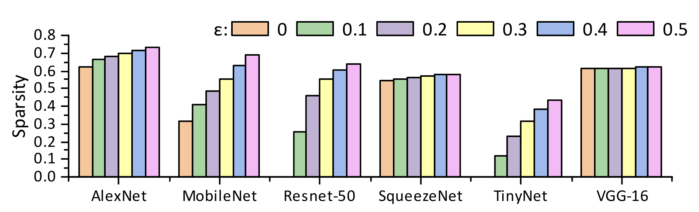

---

### Data Sparsity 数据稀疏性

对于图像信息：
1. 同一张图的不同部分复杂性不同
2. 不同图像的复杂性也有差异

综上，对于数据需要不同的推理策略。

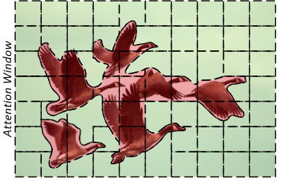
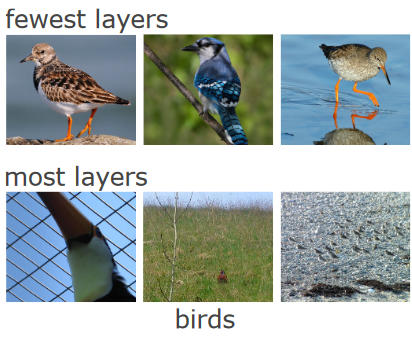

---

### Related Work 相关工作

按照决策级别可以分为如下四类：
1. Model-wise：...
2. Layer-wise：sact, SkipNet, ConvNet-AIG[3], DAQ[4], L-Net, PAME[5] ...
3. Channel-wise：DRFMP[2], C-Net[6], ZeroBN[7], FalCon[8] ...
4. Point-wise：DynConv[9] ...

> 优化决策主要有：提前退出（Early Exit）、跳过（Skip），选择（Select），量化（Quant）等。

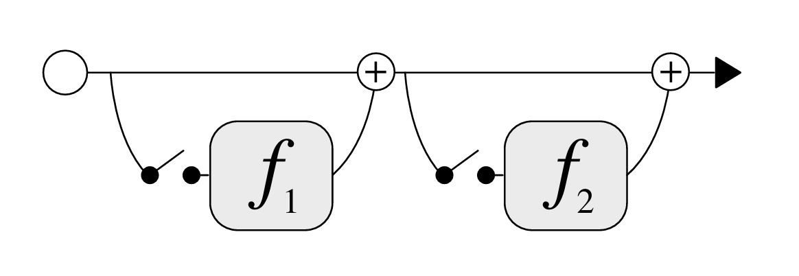
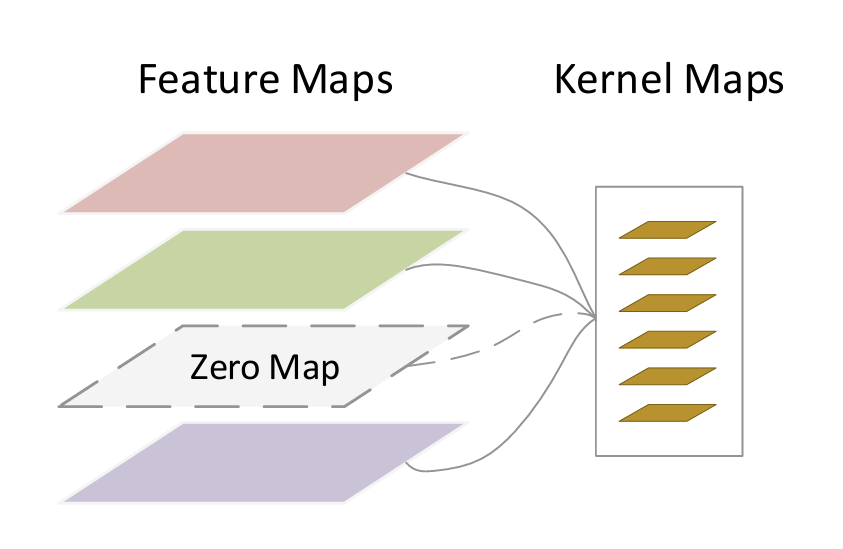
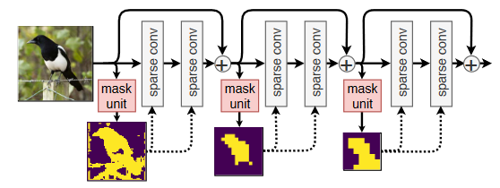

---

### Dynamic-Aware 动态感知

感知数据来源：
1. 推理数据：特征图[3][10][11]（Feature Map），参数量（Params）
2. 运行时剖析：实际时延（Actual Latency）、内存占用
3. 硬件信息：预测时延[12][13][14]（Predict Latency）、时钟频率
4. 环境数据（**具身推理引擎**）：传感器采样的数据

> 注意：收集良好的数据是进行动态决策的前提

---

### Dynamic Hook Network 动态钩子网络

DHN 是一种用于推理引擎的非侵入式的轻量网络结构，辅助主网络进行优化的动态决策，其生命周期如下：
1. 构建：在主网络文件导入时进行分析自动生成并挂载；
2. 训练：选择时机采样输入输出对，异步训练更新参数；
3. 推理：耦合进主网络同步推理，一般以门控形式决策；
4. 释放：主网络卸载后进行销毁或者保存下次使用（不修改主网络参数）。

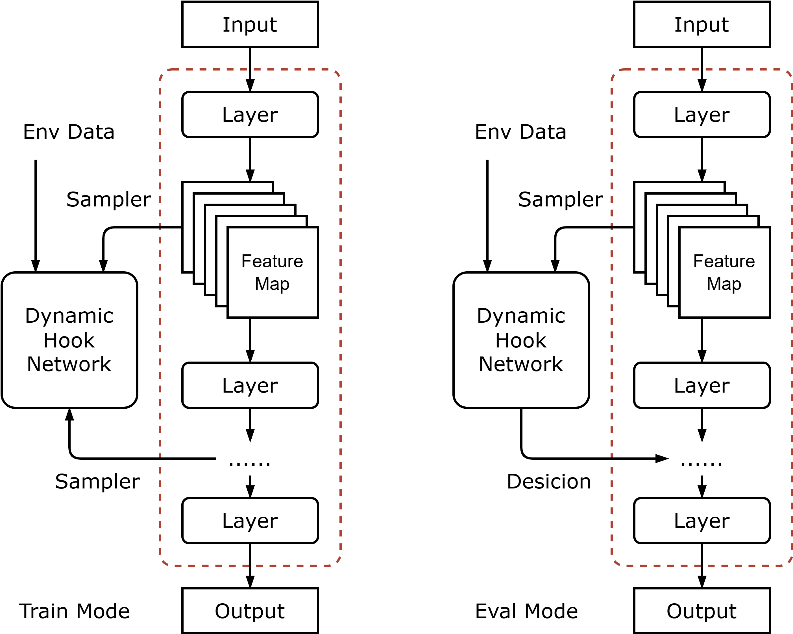

---

### Resource Consume 资源消耗分析

案例1：使用 ResNet-18 作为主干网络，LC-Net[6] 作为钩子网络（用于跳过残差块）：
相比于原模型，参数量增加（一层FC）可忽略不计，准确率有 0.65% 的提高，同时 FLOPs 减少了3倍以上。

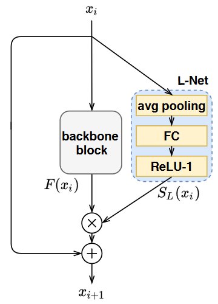 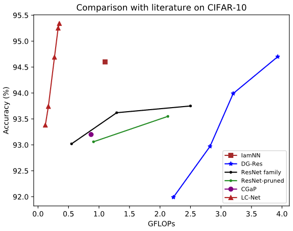

---

### Resource Consume 资源消耗分析

案例2：DQNet使用Bit-Controller[11] 作为钩子网络，动态量化来控制每一层参数的位宽：

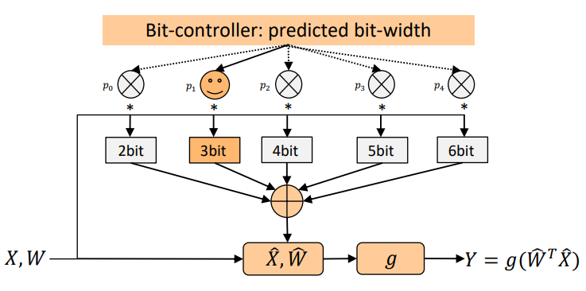 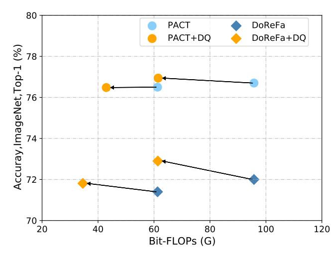

---

### 难点

现有的大部分工作都是通过修改模型结构将主副网络一起训练，若在推理引擎内实现动态钩子网络，需要考虑如下难点：
1. 采样器（Sampler）：收集运行时数据，什么时机收集、如何存储以控制内存占用；
2. 训练器（Trainer）：需要实现部分网络层的参数更新计算（考虑传统的反向传播或前向前向训练，后者是 Hinton 提出的无需求梯度的训练技术）
3. 钩子网络/算子设计：轻量有效易于训练的副网络，针对推理端设计的非侵入式网络参考较少。

---

### 引擎进度

已经支持主流 onnx 算子和部分网络，下一步将继续基于 `libonnx` 和 `darknet` 算子搭建，并参考`.tflite`设计轻量模型格式：

---

### 参考文献

[1] Adapting Neural Networks at Runtime: Current Trends in At-Runtime Optimizations for Deep Learning
[2] [Dynamic runtime feature map pruning](https://arxiv.org/pdf/1812.09922)
[3] [Convolutional Networks with Adaptive Inference Graphs](https://openaccess.thecvf.com/content_ECCV_2018/papers/Andreas_Veit_Convolutional_Networks_with_ECCV_2018_paper.pdf)
[4] DAQ: Channel-Wise Distribution-Aware Quantization for Deep Image
Super-Resolution Networks
[5] PAME: Precision-Aware Multi-Exit DNN Serving for Reducing Latencies of Batched Inferences
[6] Fully Dynamic Inference with Deep Neural Networks
[7] ZeroBN : learning compact neural networks for latency‑critical edge systems
[8] FalCon: Fine-grained Feature Map Sparsity Computing with Decomposed Convolutions for Inference Optimization

---

### 参考文献

[9] Dynamic Convolutions: Exploiting Spatial Sparsity for Faster Inference
[10] CAMixerSR: Only Details Need More “Attention”
[11] [Instance-Aware Dynamic Neural Network Quantization](https://openaccess.thecvf.com/content/CVPR2022/papers/Liu_Instance-Aware_Dynamic_Neural_Network_Quantization_CVPR_2022_paper.pdf)
[12] nn-Meter: towards accurate latency prediction of deep-learning model inference on diverse edge devices
[13] HAQ: Hardware-Aware Automated Quantization with Mixed Precision
[14] PROXYLESSNAS: DIRECT NEURAL ARCHITECTURE SEARCH ON TARGET TASK AND HARDWARE

