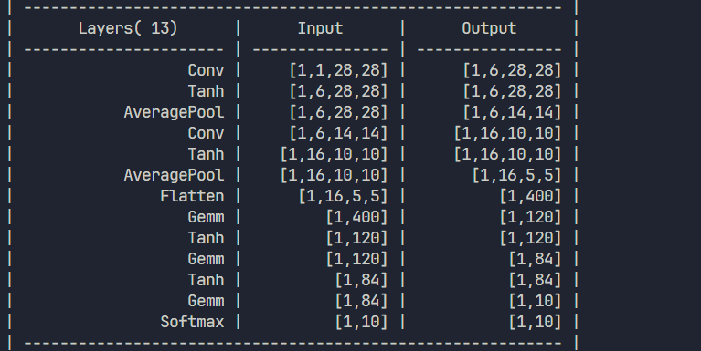

<!-- _header: 'Compute InkJet Lab' -->
<!-- _footer: evo | [Github](https://github.com/lancerstadium/evo/tree/ml) | [Docs](https://lancerstadium.github.io/evo/docs) -->

# 05 推理模型量化与设计

###### 作者：鲁天硕
###### 时间：2024/9/22

---

### Why 量化?

对模型的参数（即内置在模型文件里的张量数据）进行量化压缩，在推理侧的主要目的：
1. **减小模型参数大小**，从而减小运行时内存占用、传输时间；
2. **加快推理速度**，相对于高位宽数据计算，低位宽计算普遍较快（又称：低比特量化）；
3. **保持计算精度**，选择合适的量化方法保证模型输出质量。


---

### 量化的挑战

量化技术主要有如下挑战：
1. **精度**：任务越复杂，模型越小，精度损失越大
2. **硬件**：不同硬件低比特量化后计算的指令、方式、以及支持度不同
3. **软件**：模型参数量小不代表内存占用少（某些激活函数如 Swish、GELU 和残差连接需要额外的内存来存储中间结果），混合精度模型需要量化以及反量化（Cast算子性能问题）

> 注意：是否可以量化还是和模型与数据有关！！！

---

### 常见量化方案

1. **量化训练**（*Quant Aware Training, QAT*）：训练时尝试量化，finetune 降低误差。
2. **动态离线量化**（*Post Training Quantization Dynamic, PTQ Dynamic*）：直接将部分（混精）或全部算子的参数从 Float32 转换为 Int8/16。
3. **静态离线量化**（*Post Training Quantization Static, PTQ Static*）：使用无标签数据校准，采用 KL 散度计算量化比例因子`scale`。

> 注意：推理引擎的量化方案以后两种为主：即输入一个模型，输出一个量化后模型。


---

### 量化方案对比1

| **量化方法**           | **功能**                                                | **适用场景**                                           | **使用条件**             | **易用性** | **精度损失** | **预期收益**                  |
|------------------------|---------------------------------------------------------|--------------------------------------------------------|--------------------------|------------|--------------|-------------------------------|
| **量化感知训练 (QAT)**  | 通过在训练过程中对模型进行量化优化                       | 对精度敏感的场景，适用于日标检测、OCR等                 | 需要重新训练模型          | 中等       | **较小**      | 减少内存占用达4X，降低计算开销 |
| **静态后量化 (PTQ Static)** | 在模型部署前量化模型，提前收集代表性数据                 | 不太敏感的场景，主要应用于图像分类任务                 | 需要少量校准数据           | 简单       | **中等**      | 减少内存占用达4X，降低计算开销 |


---

### 量化方案对比2

| **量化方法**           | **功能**                                                | **适用场景**                                           | **使用条件**             | **易用性** | **精度损失** | **预期收益**                  |
|------------------------|---------------------------------------------------------|--------------------------------------------------------|--------------------------|------------|--------------|-------------------------------|
| **动态后量化 (PTQ Dynamic)** | 在推理时量化模型，访问权重时量化以减少存储和计算开销     | 模型在运行中的动态任务，如 BERT 等大模型                | 无需校准数据               | 最简单     | **较大**      | 减少内存占用达2/4X，降低计算开销 |
| **混合精度量化**       | 部分参数保持高精度，其他部分进行低精度量化               | 高性能设备或部分精度敏感的应用场景                     | 需要硬件支持               | 中等       | **较小**      | 提高推理速度，减少部分内存占用 |

---

### 量化方案对比3

| **量化方法**           | **功能**                                                | **适用场景**                                           | **使用条件**             | **易用性** | **精度损失** | **预期收益**                  |
|------------------------|---------------------------------------------------------|--------------------------------------------------------|--------------------------|------------|--------------|-------------------------------|
| **自适应量化**         | 基于任务或输入数据动态调整模型的量化参数                 | 动态变化的推理场景，适用于视频流、时序数据              | 需要动态调度算法支持       | 中等       | **最小**      | 灵活控制精度损失和计算效率   |
| **分组剪枝量化**       | 基于模型结构的稀疏性，进行分块剪枝后结合量化             | 大模型剪枝后推理优化，适合稀疏性高的模型               | 需要结构化剪枝模型         | 较复杂     | **较小**      | 降低存储空间与计算开销         |


---

### 引擎进度

1. 已支持大部分算子推理（师兄的模型就差三线性插值），支持 LetNet 模型搭建及训练（Mnist TEST任务通过，10000 个样本 ACC: 98.66%）
2. 下一步：尝试部分算子的 CUDA 加速（如：`Gemm`，三线性插值），完善 `.etm (Evo Tiny Model)`模型的量化以及保存的 API。

 


---

### 问题

- **动机**：三线性插值是否应该作为 ONNX 算子使用？实际上它和双线性插值是平行关系，都隶属于`Onnx Resize`下；且 ONNX 不同算子之间无法复用，导致代码量增大。同时 BLAS 作为一种运算库标准被大量深度学习项目使用；
- **问题**：目前的 ONNX 这层是面向模型的算子，是否需要加入中间层 BLAS（*Basic Linear Algebra Subprograms*）用于硬件加速计算？（目前来看：CUDA：cudaNN > cuBlas，Matlab, TensorFlow, Pytorch: OpenBlas）
- **区别**：ONNX 算子输入输出为`tensor`，粒度较大，不同算子之间不能互相调用（不便于硬件优化）；BLAS 算子输入输出为 C 语言基本类型，可互相调用，也可被 ONNX 算子调用（例如：`sgemm`可用于 ONNX 的 `Gemm`, `MatMul`），粒度较小；
- **优点**：模型无关，更底层，可复用于 ONNX 算子，便于硬件优化。
- **缺点**：如果要实现全部 BLAS 标准太复杂，运算时并不需要所有 BLAS 标准函数。

---

### BLAS dgemm API

```c
void cblas_dgemm 
(
	const CBLAS_LAYOUT Layout,
	const CBLAS_TRANSPOSE transa,
	const CBLAS_TRANSPOSE transb, 
	const CBLAS_INT m, 
	const CBLAS_INT n, 
	const CBLAS_INT k, 
	const double alpha,
	const double *a, 
	const CBLAS_INT lda, 
	const double *b, 
	const CBLAS_INT ldb, 
	const double beta, 
	double *c, 
	const CBLAS_INT ldc
);
```
> API 较为复杂，可简化。

---

### 参考文献

[1] [AI推理引擎——离线压缩](https://zhuanlan.zhihu.com/p/603745783)
[2] [感知量化训练](https://www.mindspore.cn/docs/programming_guide/zh-CN/r1.6/apply_quantization_aware_training.html)
[3] [TensoRT量化第四课：PTQ与QAT](https://blog.csdn.net/qq_40672115/article/details/130489067)