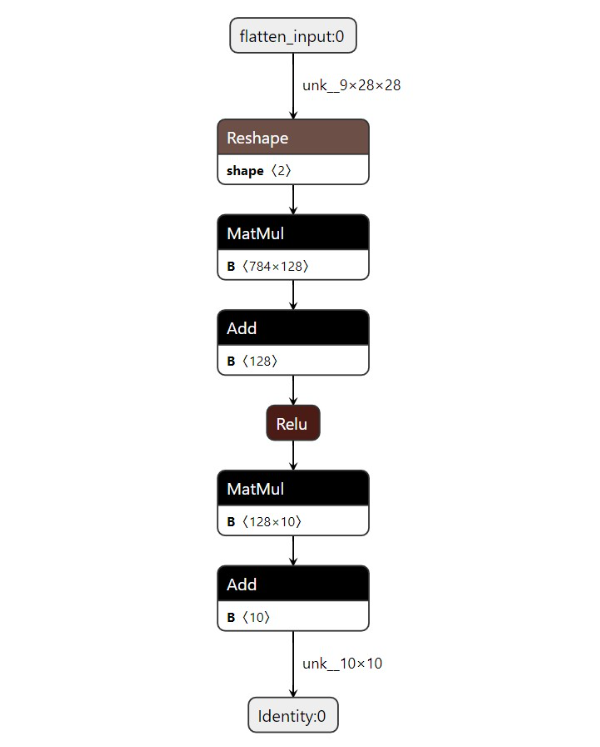

<!-- _header: 'Compute InkJet Lab' -->
<!-- _footer: evo | [Github](https://github.com/lancerstadium/evo/tree/ml) | [Docs](https://lancerstadium.github.io/evo/docs) -->

# 06 推理引擎与硬件加速

###### 作者：鲁天硕
###### 时间：2024/9/28

---

### Why 边缘推理框架

在边缘设备上使用专用框架进行推理：
1. **模型**：易于模型部署，保证模型精度
2. **系统**：降低推理延迟，减小内存占用
3. **硬件**：降低运行功耗，提高数据吞吐量

> 简而言之：模型 -> 推理框架 -> 高性能可执行程序

---

### 主流推理框架功能

推理引擎框架都采用分层式设计，主要包含静态侧和动态侧两部分功能：
1. 静态侧：模型转换、静态模型压缩、静态图优化 ...
2. 动态侧：模型加载、运行时量化、异构执行 ...

---

### EVO 框架

- 采用分层式模块架构：
  - 上层提供多种编程语言的开发模块
  - 核心提供模型的转换、压缩以及运行时
  - 下层对Host端设备进行算子调度
- **关键词**: Lite > High Performance > Easy to Use > Compatibility

---

### 模型转化与可视化

ONNX 模型是最通用的模型转化格式，也是部署常用的模型格式：

 

---

---

### 框架进度

支持：
1. `.onnx`模型载入解析
2. 主流算子和部分模型 CPU 前向推理
3. `.etm`轻量化模型格式保存与解析
4. [可选] 训练：Loss 计算与 SGD 优化器

 

> 继续：CUDA(AVX, NEON) 算子加速、RISCV 裸机移植、引擎感知优化