<!-- _header: 'Compute InkJet Lab' -->
<!-- _footer: evo | [Github](https://github.com/lancerstadium/evo/tree/ml) | [Docs](https://lancerstadium.github.io/evo/docs) -->

# 07 CV 动态感知推理

###### 作者：鲁天硕
###### 时间：2024/10/25

---

### 推理优化策略


相比于 LLM 大模型推理，CV 端侧任务的推理优化方向：

1. **异构内存管理**：主要面向 MTI（多任务推理）场景进行优化，主要技术有：静态分配、张量内存调度、稀疏感知、PIM（存内计算）等。
2. **动态训练后量化**：不同于 QAT （量化感知训练）和 SPTQ （静态训练后量化），在运行时采样量化降低了模型推理精度损失。（一般量化到 INT-8，低比特量化需要专用硬件加速推理）
3. **层跳过**：对于一些相同的网络层，在推理时执行决策跳过，降低能耗和推理时间。
4. **提前退出**：对于特定网络设计桥和出口，在推理时执行决策提前退出，（论文比较新和多）。
5. **BNN/TNN**：量化的一种激进形式，使用专用算子和硬件进行推理加速。（理论丰富，应用一般）


---

### 无电池嵌入式系统上预训练模型的内存高效能量自适应推理


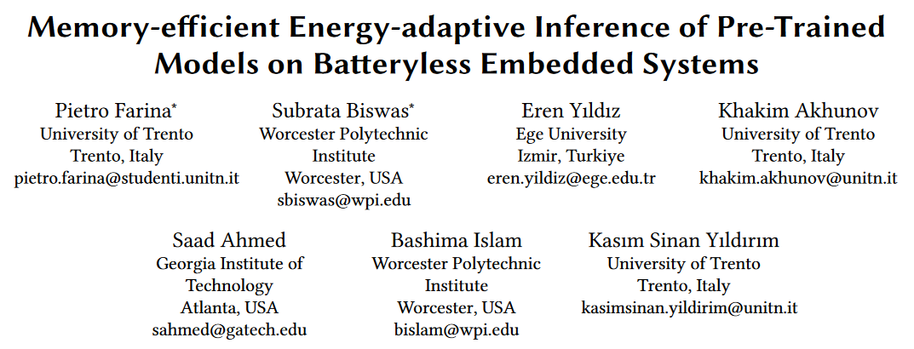

The 21st International Conference on Embedded Wireless Systems and Networks (EWSN'24), 2024.05.13.


---

### 无电池嵌入式系统上预训练模型的内存高效能量自适应推理

贡献：
1. 一种模型压缩方法：通过稀疏性再训练来压缩 DNN 模型，以减少模型参数。
2. 一种提前退出方案：即插即用的全局退出层 gNet ，用于平衡精度和能耗。

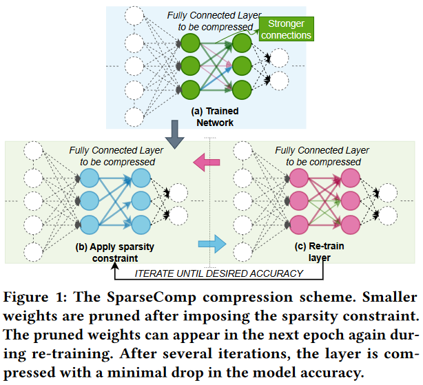 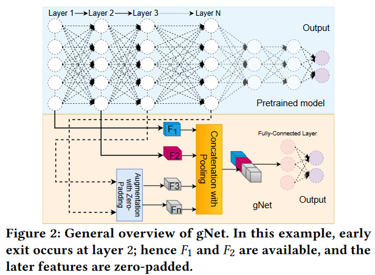


---

### 无电池嵌入式系统上预训练模型的内存高效能量自适应推理

结论：在 Cifar-10 进行图像分类
1. 通过调整 gNet 的参数量，发现参数量越大的 gNet ，精度越高；
2. 设置 gNet 后，平均退出时间和能量消耗有所降低。

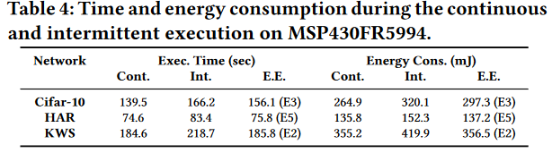

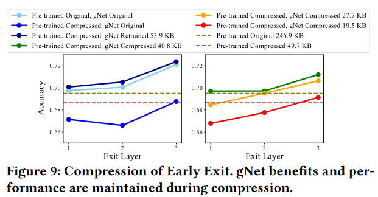 
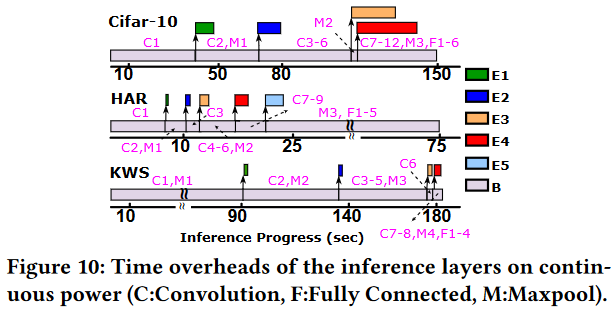


---

### 想法：使用 BNN 进行动态决策

BNN 优势：
1. 内存占用少
2. 输出简单：{-1, 1} 空间的输出适用于进行决策
3. 敏捷训练：训练简便，开销较全精度低

BNN 劣势：
1. 信息丢失：特征图信息从浮点转化为二元
2. 专用算子：需要设计专用算子

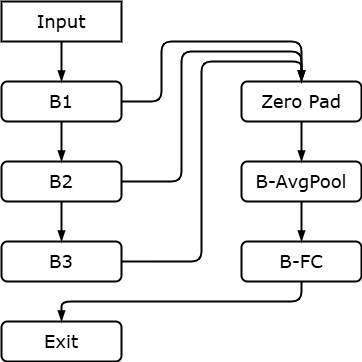

---

### 引擎进度

 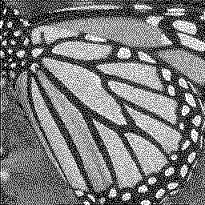 


```txt
    Origin(256x256)        HT(256x256)                  SR(512x512)
    Model Size:               1.36MB                       5.24MB
```

---

### 引擎进度

- 半调任务：256x256 
- 超分任务：256x256 -> 512x512

综上：Conv 的时延占比最高，其次是 Add 算子。

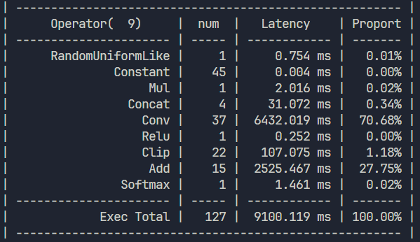
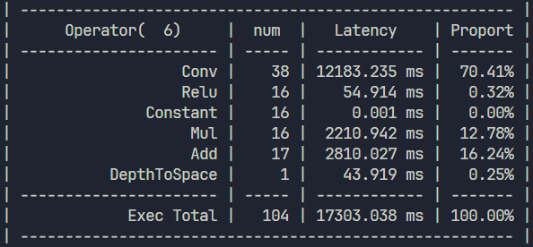

---
### 问题

尝试部署 Onnx 的 Int8 量化，失败：Ort 找不到它自己量化过的算子。。。
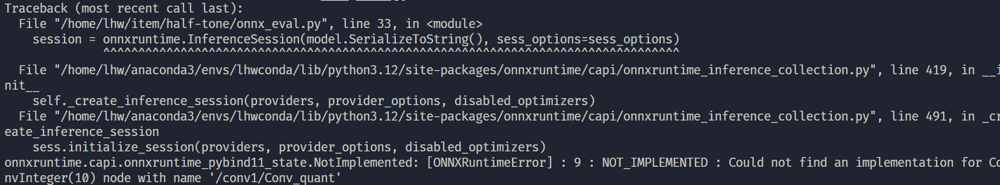

---

### 全精度网络量化过程1

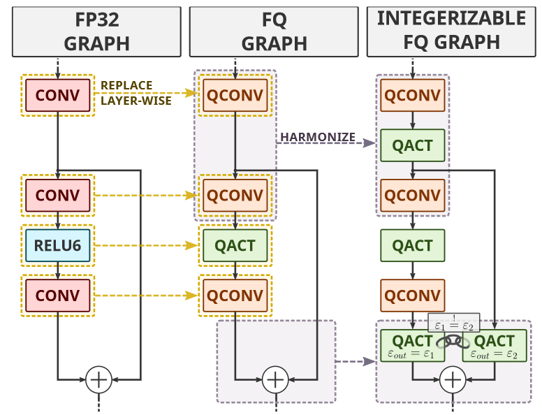

---
### 全精度网络量化过程2

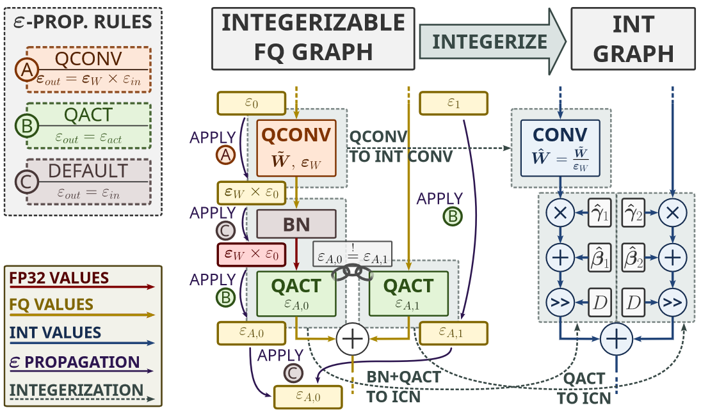