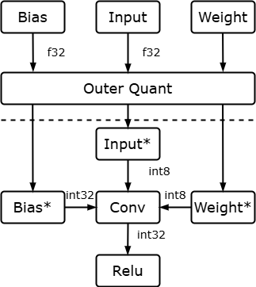
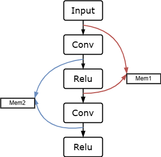
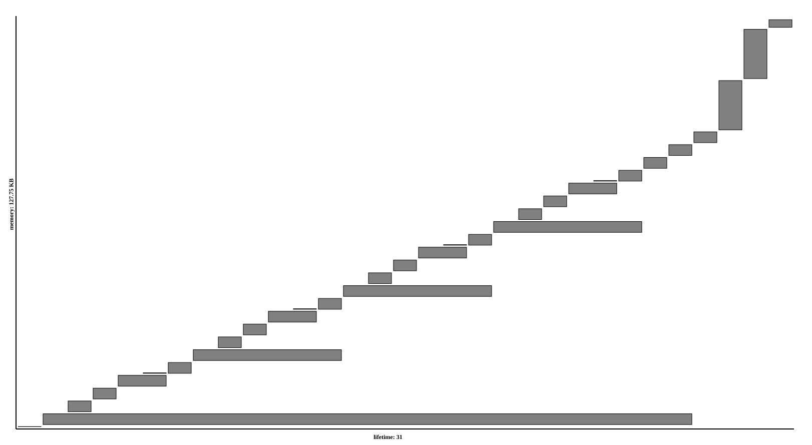
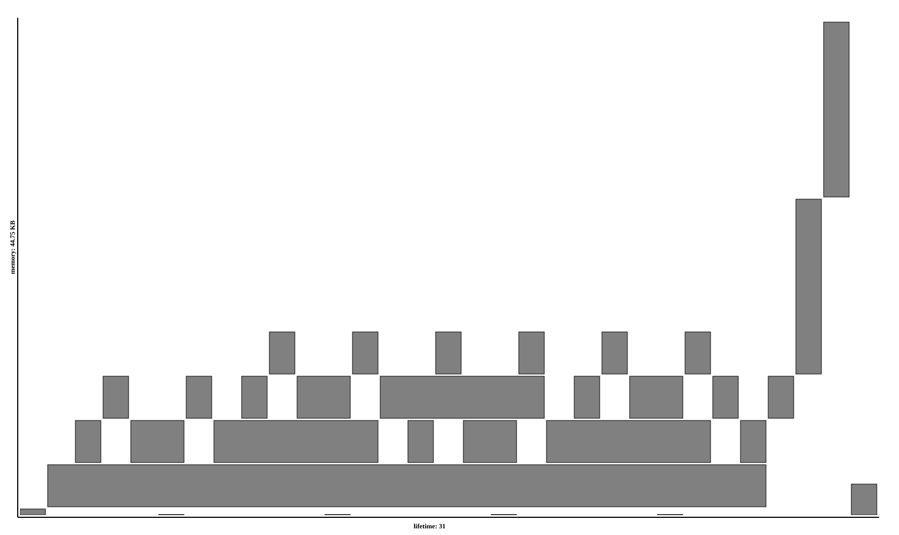

<!-- _header: 'Compute InkJet Lab' -->
<!-- _footer: evo | [Github](https://github.com/lancerstadium/evo/tree/ml) | [Docs](https://lancerstadium.github.io/evo/docs) -->

# 08 推理内存管理

###### 作者：鲁天硕
###### 时间：2024/11/1

---

### 量化方案

目前的难题是对于全精度网络的完整的量化（int8），主要思路如下：
1. input 张量：使用代表性的张量获取 scale 和 zero_point（正确性存疑）
2. weight 张量：正常量化，获取其 scale 和 zero_point （这一步没啥毛病）
3. bias 张量：根据上面量化结果获取 scale ，需要量化到 int32 （高精度）

$$
\begin{align*}
\\
\left\{
\begin{aligned}
&\text{bias}_{\text{scale}} = \text{input}_{\text{scale}} \times \text{weight}_{\text{scale}} \\
&\text{bias}_{\text{zero\_point}} = 0
\end{aligned}
\right.
\end{align*}
\\
$$

> 注意： 现在使用的是 Min-Max 量化方案，量化精度可能不够

---

### 内存复用理论

- 计算图中存在两种张量：权重张量使用模型压缩（量化、剪枝）来减少内存占用，而中间张量则使用内存复用（内存）减少
- 和操作系统调度不同：静态图的中间张量大小是固定的，可以使用静态分配一大块内存，分析张量生命周期并使用偏移量来复用。

---
### Naive: Alloc All Memory

- 若正常静态分配一个模型（tiny-edsr 127.75KB）：横轴为生命周期，纵轴为内存占用

---

### LSTF: Large Size Tensor First

- 使用大张量优先算法对内存进行静态分配（tiny-edsr 44.75KB）：中间张量内存占用降低 64.97%

---

### 后续工作

- 量化优化：后续会实现其他量化方案，并考虑改进量化算法
- 内存复用：实现其他复用方案，寻找优化点
- 比赛：使用量化技术和 LSTF 内存复用技术编写 .c 文件