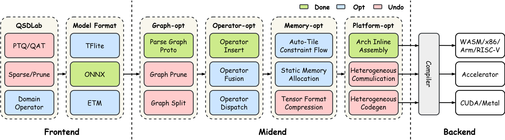

<!-- _header: 'Compute InkJet Lab' -->
<!-- _footer: evo | [Github](https://github.com/lancerstadium/evo/tree/ml) | [Docs](https://lancerstadium.github.io/evo/docs) -->

# 10 硬件友好型神经网络初探

###### 作者：鲁天硕
###### 时间：2025/1/17

---

### Index in Route

**Keyword**: *Domain Operator*, *Memory Allocation*, *Hardware Accleration*

---

### 